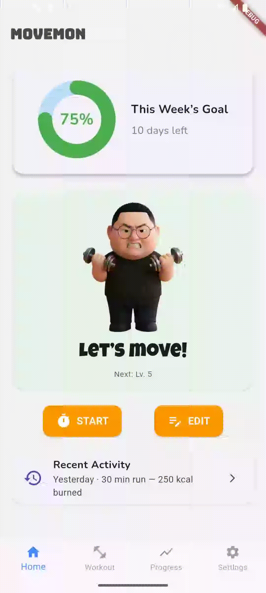

# Movemon

[](https://drive.google.com/uc?export=download&amp;id=1qjLP6FMAj0vPLznzC0G3KaJ-nJ1uDsIQ)

[](https://opensource.org/licenses/MIT)

**Turn your workouts into a game. Your physical activity evolves your unique character!**
[⬇️ Jump to APK download](#android-apk)

## Table of Contents
- [Android APK](#android-apk)
- [Features](#-features)
- [Tech Stack & Architecture](#-tech-stack--architecture)
- [Getting Started](#-getting-started)
- [Project Structure](#-project-structure)
- [License](#-license)
  

Movemon is a gamified fitness application where you raise your own character based on your workout records. It aims to provide powerful motivation through a sense of accomplishment and fun for those who find it difficult to maintain a consistent exercise routine.

<p align="left">
  
</p>
<p>
  <a href="https://drive.google.com/uc?export=download&amp;id=1qjLP6FMAj0vPLznzC0G3KaJ-nJ1uDsIQ">
    
  </a>
</p>

<br>

## 📱 Android APK

- **Direct download:** [Download APK (Google Drive)](https://drive.google.com/uc?export=download&amp;id=1qjLP6FMAj0vPLznzC0G3KaJ-nJ1uDsIQ)
- **Open in Drive (preview):** https://drive.google.com/file/d/1qjLP6FMAj0vPLznzC0G3KaJ-nJ1uDsIQ/view?usp=sharing

> **Note:** On first install, you may need to temporarily allow installation from **Unknown sources** (Settings → Apps → Special access → Install unknown apps → enable for the app you use to download). Turn it **off again after installation**.

<br>

## ✨ Features

  - **🌱 Character Growth System**: Your character evolves and grows based on your workout data (consecutive days, total time, etc.). If you skip workouts for too long, the character may devolve, encouraging you to stay consistent.
  - **🎯 Goal Setting & Management**: Set personalized goals, such as weekly workout frequency and duration, and visually track your progress.
  - **⏱️ Workout Logging**: Easily log and manage your workouts using the in-app timer or by manual entry.
  - **🏆 Badge System**: Earn special badges for achieving various milestones like workout streaks and cumulative goals to enhance your sense of accomplishment.
  - **📊 Data Reports**: Weekly and monthly statistics are provided with charts and graphs, allowing you to see your progress at a glance.
  - **🚀 Social Login**: Get started easily with social logins, including Kakao and Google.

<br>

## 🚀 Tech Stack & Architecture

Movemon is built with a monorepo architecture, with separate components for the frontend, backend, and database.

| Component      | Technologies                                                                                      | Role                                                     |
| -------------- | ------------------------------------------------------------------------------------------------- | -------------------------------------------------------- |
| **Frontend** |   | Cross-platform mobile application (iOS/Android)          |
| **Backend** |   | Handles business logic and serves a RESTful API          |
| **Database** |            | Stores and manages all data, including users and workouts |

<br>

## 🛠️ Getting Started

To run this project in your local environment, please follow the steps below.

### 1\. Prerequisites

  - [Git](https://git-scm.com/)
  - [Flutter SDK](https://flutter.dev/docs/get-started/install) (v3.x or higher)
  - [Python](https://www.python.org/downloads/) (v3.10 or higher)
  - [PostgreSQL](https://www.postgresql.org/download/) (v14 or higher)

### 2\. Clone the Project

```bash
git clone https://github.com/kim-dabin/Movemon.git
cd Movemon
```

### 3\. Database Setup

1.  Connect to PostgreSQL and create a new database and user.

    ```sql
    -- psql -U postgres
    CREATE USER your_user WITH PASSWORD 'your_password';
    CREATE DATABASE movemon_db OWNER your_user;
    ```

2.  Execute the `db/schema.sql` file on the newly created database to set up the tables and initial data.

    ```bash
    psql -U your_user -d movemon_db -f db/schema.sql
    ```

### 4\. Running the Backend

1.  Navigate to the `services` directory, then create and activate a virtual environment.

    ```bash
    cd services
    python -m venv venv
    source venv/bin/activate  # macOS/Linux
    # venv\Scripts\activate    # Windows
    ```

2.  Install the dependencies from the `requirements.txt` file.

    ```bash
    pip install -r requirements.txt
    ```

3.  Modify the `DATABASE_URL` in `services/database.py` to match your database credentials.

4.  Run the FastAPI server.

    ```bash
    uvicorn main:app --reload
    ```

    The server will be running at `http://127.0.0.1:8000`.

### 5\. Running the Frontend

1.  Navigate to the `apps/movemon` directory.

    ```bash
    cd apps/movemon
    ```

2.  Install the Flutter packages.

    ```bash
    flutter pub get
    ```

3.  Modify the `_baseUrl` in `apps/movemon/lib/services/api_service.dart` to match the backend server address.

      - **For Android Emulator**: Use `'http://10.0.2.2:8000'`
      - **For iOS Simulator / Physical Device**: Use `'http://127.0.0.1:8000'` or your computer's local network IP.

4.  Run the application.

    ```bash
    flutter run
    ```

<br>

## 📂 Project Structure

```
.
├── apps          # Frontend Flutter application
│   └── movemon
├── db            # Database schema (DDL) and initial data
│   └── schema.sql
├── services      # Backend FastAPI application
└── README.md
```

<br>

## 📄 License

This project is licensed under the [MIT License](https://opensource.org/licenses/MIT).